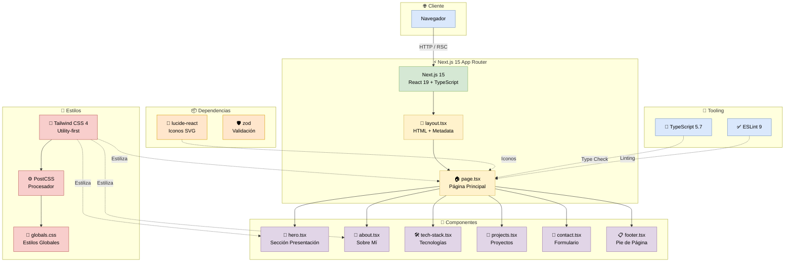
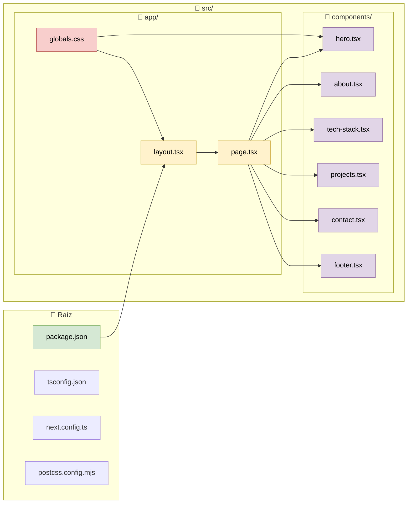
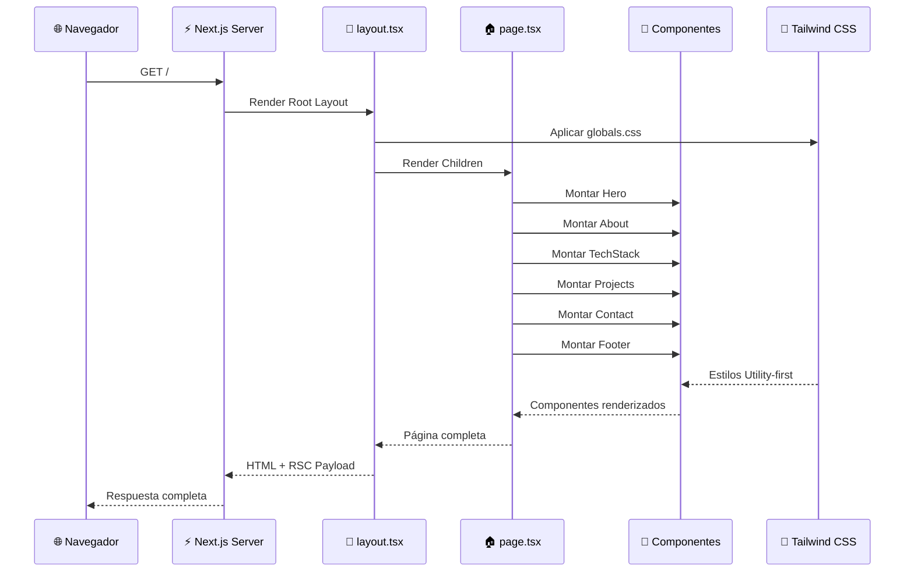

# 🏗️ Arquitectura del Portafolio - Next.js 15 + React 19



## 📂 Estructura de Archivos



## 🔄 Flujo de Renderizado



## 📊 Tecnologías Usadas

```mermaid
pie title Stack Tecnológico
    "React 19" : 25
    "Next.js 15" : 25
    "TypeScript" : 20
    "Tailwind CSS 4" : 15
    "Lucide React" : 10
    "Zod" : 5